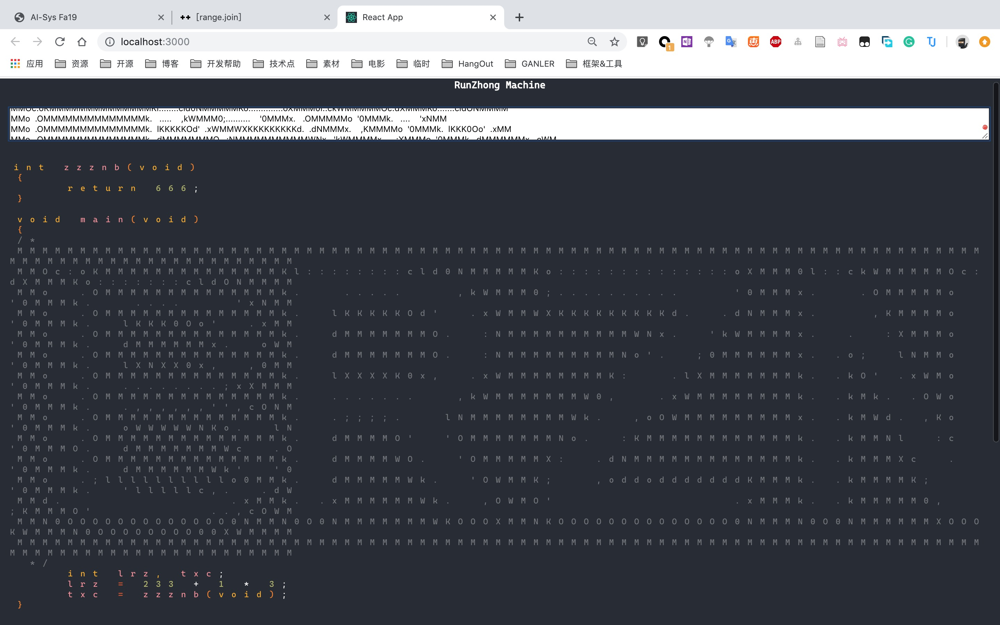
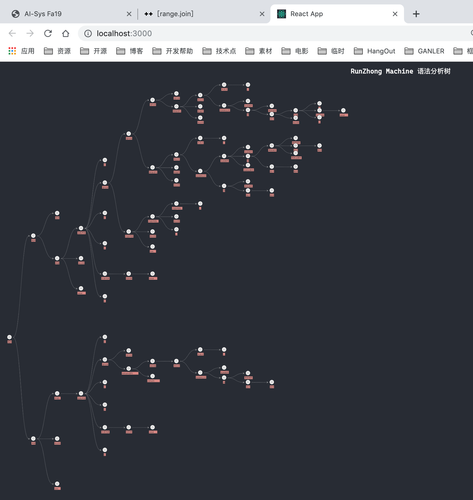
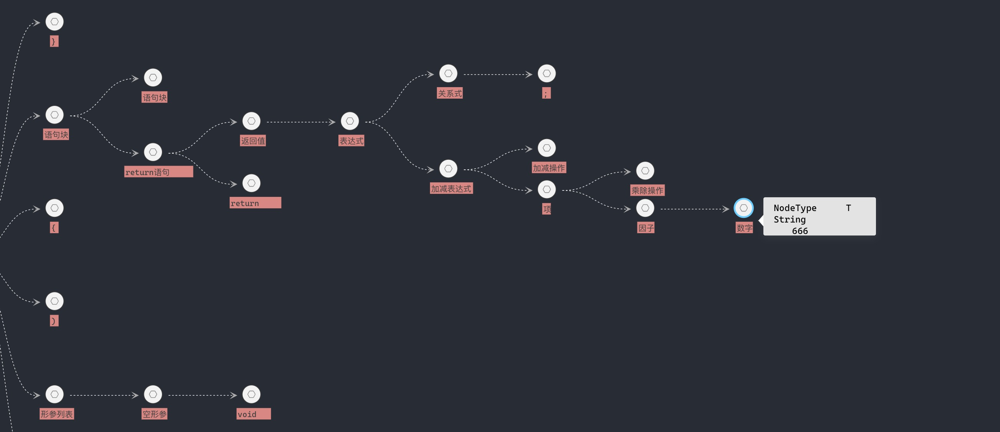
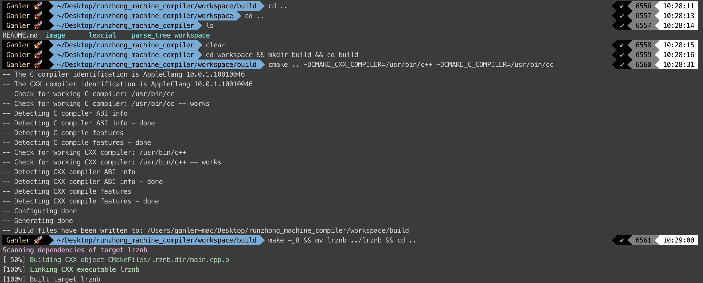
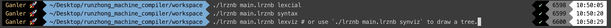

# RunzhongMachineCompiler

*Runzhong Machine, the DEEP DARK OLD MAGIC inspired from my old friend Runzhong Li.*


## Author Info

> - Jiawei Liu@ganler
>   - Project Manager;
>   - CXX backend;
>   - Algorithm(Both in compiler design and performance optimization);
> - Junyao Li@taltalite
>   - React Frontend;
> - Zizheng Zhong@zzznb
>   - Algorithm.

## Key Feather

- **High-quality Modern C++ Code.**
  - I made heavy use of generic programming technics. You can easily use user-defined container and string if you like.
  - I made heavy use of `std::string_view` to avoid any kinds of unnecessary evil string copies(Well, that's why it has better performance).
  - Zero-Dependency(C++): All C++ codes use STL only, including multi-threading. (Well, I am a modern C++ programmer who care everything about performance and beautiful code😎)
- **Beautiful GUI**(As you can see below).
- **Fork&Join based lexcial analysis**(To make the lexcial analysis procedure faster🚀)

## Demo

### Lexcial GUI



### Syntax GUI





## Build CXX

> As I am a modern C++ programmer, you may need to upgrade your compiler to support C++17.
>
> > `std::string_view` will boost the performance of your application!




## Build React

> Make sure that `node.js` is installed on your computer.

```shell
mv parse_tree ../parse_tree
mv lexcial ../lexcial

npx create-react-app parse_tree # long time to install react components
npx create-react-app lexcial

cp -r ../parse_tree/ parse_tree/
cp -r ../lexcial/ lexcial/

cd lexcial
npm install typescript
unset HOST
npm start # then you gonna see them.

cd ../parse_tree
npm install d3
npm install antd
unset HOST
npm start # then you gonna see a parse-tree. Wonderful!
```

## Lexcial & Syntax Analysis



## Brief Intro to Our Design

> Note that our procedure of lexcial analysis is **parallelized**(I used the `fork&join` model to analyze each line. But of course, you need to deal with multi-line comment issue first(give it a single pass!)).


## TODO

- Upload our report(More tech details)